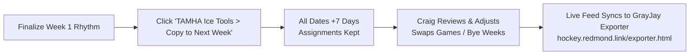

# TAMHA Ice Scheduler 1-Click Rollover & Automation Guide

A seamless, zero-fatigue workflow for the TAMHA Ice Scheduler (Craig). Rather than manually copying 25 sheets, clearing slots, and re-typing hundreds of dates and team assignments, this system allows copying the established schedule forward week-by-week with team assignments intact for fast review and adjustment.

---

## Why "Copy With Assignments" is the Superior Workflow

In minor hockey associations:
1. **Recurring Practice Rhythms**: ~85%–90% of practice contracts (e.g. U13A on Tuesdays 7:00 PM at Deuvilles, U11AA on Wednesdays at RECC) repeat every single week throughout the season.
2. **Re-Assigning from Scratch is Wasted Time**: Blanking out team slots each week forces the scheduler to re-assign 38 teams over and over again.
3. **The "Copy & Review" Workflow**:
   - Craig dials in the base weekly rhythm once in Week 1.
   - For Week 2, he clicks **1-Click Rollover**.
   - The system duplicates the sheet, advances all calendar dates by 7 days, and keeps all team assignments in place.
   - Craig only needs to spend 2–3 minutes swapping specific weekend game matchups, bye weeks, or tournament conflicts.

---

## How to Set Up the Tool (30 Seconds)

1. Open the master **TAMHA Ice Schedule Google Sheet**.
2. Go to the top menu and select **Extensions > Apps Script**.
3. Clear out any existing placeholder text in the editor.
4. Copy and paste the script from `templates/TAMHA_Ice_Scheduler_Apps_Script.js`.
5. Click the **Save** icon (disk symbol) and give the project a name like `TAMHA Ice Tools`.
6. Refresh the Google Sheet in your web browser.

A custom menu named **`TAMHA Ice Tools`** will appear in the top toolbar!

---

## Weekly Scheduler Workflow

### Step 1: Establish Week 1 Base
Populate the recurring practice slots across Deuville’s Rink, Colchester Legion Stadium, RECC, and West Colchester (Debert).

### Step 2: 1-Click Rollover
Whenever you're ready to schedule the following week:
1. Select the current week's tab (e.g., `Week_1_Oct_05_11`).
2. Click **`TAMHA Ice Tools` > `📅 Copy Current Week to Next Week (+7 Days)`**.
3. Confirm the prompt.

**What the tool does automatically:**
* Duplicates the current week with 100% formatting, colors, and dropdowns preserved.
* Copies all team assignments forward so no re-typing is necessary.
* Increments all calendar dates forward by exactly 7 days.
* Renames the sheet tab cleanly (e.g., `Week_2_Oct_12_18`).
* Places the new tab immediately after the previous week.

### Step 3: Fast Review & Exception Handling
Craig opens the new tab and makes any needed adjustments:
* Swap teams if a team is travelling out of town for an away tournament.
* Mark unused or returned ice as `[OPEN]` so other coaches can claim it.
* Assign weekend game slots to visiting league opponents.

### Step 4: Team Managers Export to GrayJay
Because all dates and team strings match the canonical TAMHA format, team managers visit:
👉 **[https://hockey.redmond.link/exporter.html](https://hockey.redmond.link/exporter.html)**

Managers select their team, download their `.xlsx` import file, and upload directly into GrayJay Central in 10 seconds.
