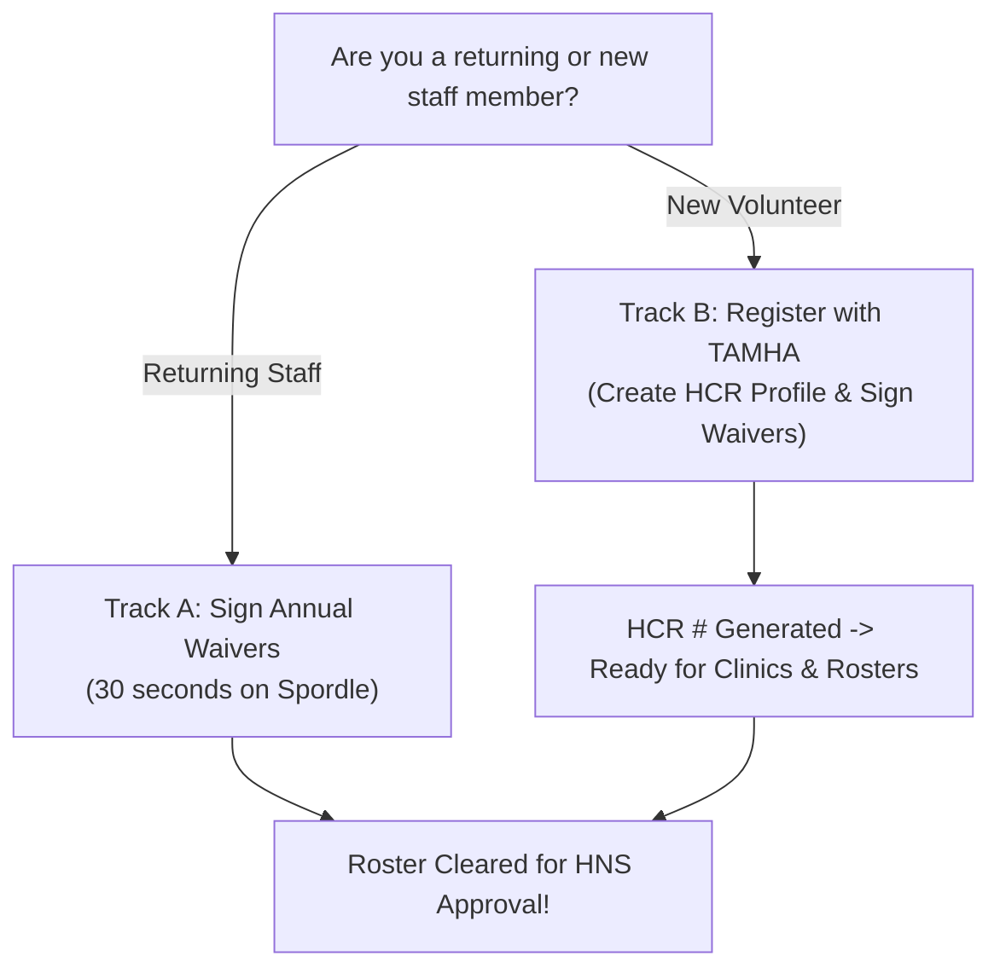

# TAMHA Staff Onboarding: HCR 3.0 Profile Setup & Mandatory Waiver Sign-Off

A quick, step-by-step visual standard operating procedure for all **TAMHA Bench Staff** (Head Coaches, Assistant Coaches, Team Managers, Trainers, and Dressing Room Volunteers) to verify account details, sign annual waivers, and register new volunteer profiles in the **Hockey Canada Registry (HCR 3.0 / Spordle)**.

---

## ⚡ Why This Matters (The #1 Roster Approval Blocker)

> [!IMPORTANT]
> **Hockey Nova Scotia (HNS) will not approve an official team roster until every staff member has completed their annual waiver sign-off.** Unsigned waivers or missing HCR profiles are the single most common reason team approvals are delayed at the start of the season.

---

## 🧭 Which Track Are You On?

---

## Track A: Returning Staff (Annual Waiver Sign-Off)

If you have coached, managed, or volunteered in minor hockey previously, your HCR account already exists. You simply need to sign your annual waivers:

1. **Sign In:** Go to **[myaccount.spordle.com/login](https://myaccount.spordle.com/login)** (or **[register.hockeycanada.ca](https://register.hockeycanada.ca)**).
2. **Locate To-Do Card:** On your main Spordle dashboard, look for the **To Do** alert box.
3. **Click Complete:** Click the blue **Complete** button next to **Action Required: You have required tasks to complete**.

4. **Review & Sign:** Carefully review and digitally sign the mandatory Hockey Canada and Hockey Nova Scotia waivers.
5. **Verify Status:** Once signed, your profile will immediately show in the association portal as cleared and ready for official roster assignment.

---

## Track B: New Coaches & Volunteers (First-Time Profile Setup)

If you are a new coach, manager, or safety person who has never been registered in Hockey Canada, you must create a profile and link it to TAMHA:

### Step 1: Sign In or Create an Account
Navigate to **[myaccount.spordle.com/login](https://myaccount.spordle.com/login)**. If you do not have a Spordle account, click **Sign Up** to create one using your personal email address.

### Step 2: Click "Register Now" on Dashboard
From your Spordle Dashboard, click the blue **Register Now** button, or find **Truro Area Minor Hockey Association (TAMHA)** under your Spordle Pages.

### Step 3: Open the TAMHA Association Registration Page
Search for **Truro** and choose:
> **Association: TRURO AREA MINOR HOCKEY ASSOCIATION (TAMHA)**

On the TAMHA Spordle landing page, click the red **Register Now** button.

### Step 4: Select "New Coaches/Volunteers"
In the registration modal:
1. Select the **New Coaches/Volunteers** category (Fee: **Free / $0.00**).
2. Confirm your participant profile details.
3. Click the black **Register now** button.

### Step 5: Complete Prompts & Sign Waivers
Follow the on-screen checkout steps ($0.00 balance) to:
* Review and digitally sign all required **Hockey Canada / HNS Waivers**.
* Complete registration.

### Step 6: Share HCR Number with Team Manager
Once completed, your unique **HCR Number** is generated. Send your Full Name, Date of Birth, and HCR # to:
* Your **Team Manager** (for roster submission)
* **`tamhaweb@trurominorhockey.ca`** (to set up GrayJay staff access)

You can now log into your HCR account at any time to enroll in required coaching clinics, Respect in Sport (Activity Leader), and HU-Safety.

---

## 📋 Quick Reference Links

* **Spordle Account Sign-In:** [myaccount.spordle.com/login](https://myaccount.spordle.com/login)
* **Hockey Canada Registry Portal:** [register.hockeycanada.ca](https://register.hockeycanada.ca)
* **HNS Coaching & Clinic Requirements:** [hockeynovascotia.ca/coach/coaching-requirements](https://hockeynovascotia.ca/coach/coaching-requirements)
* **TAMHA Criminal Record Checks (CRC):** [trurominorhockey.ca/pages/4117/Records-Checks/](https://trurominorhockey.ca/pages/4117/Records-Checks/)
* **TAMHA Registrar / Webmaster:** `tamhaweb@trurominorhockey.ca`
