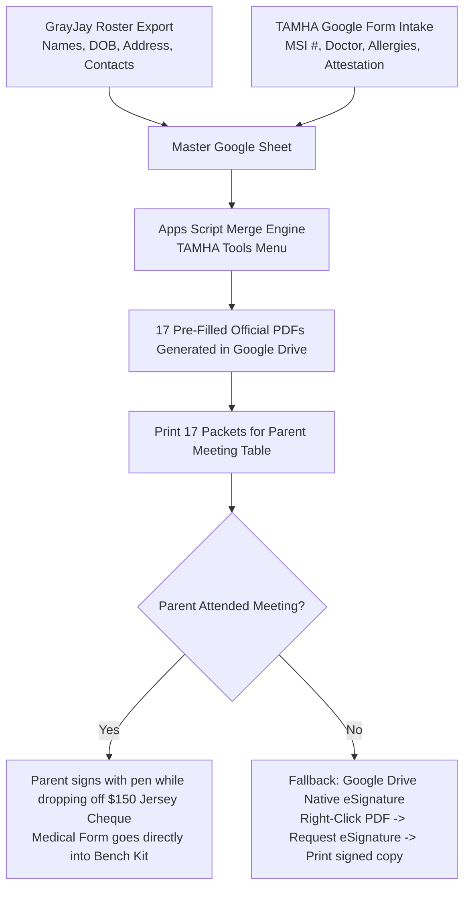

# TAMHA Paperless Forms & Intake Pipeline (2026–2027)

A privacy-compliant, zero-subscription digital intake and form generation system built inside the official TAMHA Google Workspace ecosystem (`@trurominorhockey.ca`). Designed for Weston's U13A team and easily cloneable for William's team or other association managers.

---

## 1. System Overview & Privacy Compliance

Minor hockey documentation involves sensitive **Personal Health Information (PHI)** (Nova Scotia MSI health card numbers, allergies, concussion histories, emergency contacts) and **Personal Identifiable Information (PII)** (dates of birth, home addresses, phone numbers).

* **Strict In-Tenant Boundary:** All data collection, spreadsheet storage, and PDF generation occur exclusively within the association's Google Workspace tenant (`trurominorhockey.ca`).
* **Zero Third-Party Data Exposure:** No player data is sent to external cloud APIs, public form tools, or personal drives.
* **Safety Binder Compliance:** Fulfills the Hockey Canada / Hockey Nova Scotia requirement that physical medical information sheets must reside in the team trainer's first-aid kit on the bench at all times.

---

## 2. End-to-End Workflow



---

## 3. Component Setup Guide

### Step 1: Create the Intake Google Form
In your `@trurominorhockey.ca` account, create a form titled **`TAMHA 2026-2027 Player Medical & Team Intake`**.

* **Section 1: Player Selection**
  * `Player Full Name` (Dropdown matching roster, or Short Answer)
* **Section 2: Healthcare & Providers**
  * `Nova Scotia MSI / Health Card # & Expiry` (Short answer)
  * `Family Doctor Name & Clinic Phone` (Short answer)
  * `Family Dentist Name & Phone` (Short answer)
* **Section 3: Medical Conditions & Safety Disclosures**
  * `Known Allergies & EpiPen Requirements` (Paragraph - or "None")
  * `Asthma / Inhaler Requirements` (Paragraph - or "None")
  * `Concussion History within the last 12 months` (Paragraph - or "None")
  * `Other Medical Conditions, Medications, or Recent Injuries` (Paragraph - or "None")
  * `Secondary Emergency Contact (Name, Relation & Phone)` (Short answer - someone reachable if parents are unavailable)
* **Section 4: Mandatory Acknowledgments & Attestation**
  * Checkbox: *"I verify that all information provided is accurate and complete. I have read and agree to the TAMHA Parent/Player Code of Conduct, the 24-Hour Rule, and authorize emergency medical treatment as outlined in the Hockey Canada Safety Program."*
  * `Parent/Guardian Name (Electronic Attestation)` (Short answer)
  * `Date` (Auto-captured by form timestamp)

*Link the form responses to your Master Team Google Sheet.*

---

### Step 2: The Google Doc Template (`Player Medical Information Sheet`)
Create a Google Doc in your team Drive named **`TEMPLATE - Player Medical Information Sheet`**.

Format it to match the standard Hockey Canada layout with these exact merge tags:
* `{{PLAYER_NAME}}`
* `{{JERSEY_NUM}}`
* `{{DOB}}`
* `{{ADDRESS}}`
* `{{HEALTH_CARD}}`
* `{{DOCTOR}}`
* `{{DENTIST}}`
* `{{PARENT1_INFO}}`
* `{{PARENT2_INFO}}`
* `{{EMERGENCY_CONTACT}}`
* `{{ALLERGIES}}`
* `{{CONDITIONS}}`
* `{{CONCUSSIONS}}`
* `{{SIGNATURE}}`
* `{{DATE}}`

---

### Step 3: Google Apps Script (`TAMHA_Forms_Generator.gs`)

In your Master Google Sheet, navigate to **Extensions** $\rightarrow$ **Apps Script**, replace the code editor with the following script, and update the `CONFIG` values:

```javascript
/**
 * TAMHA Team Manager Toolkit - Official Form Generator
 * Privacy-First: All processing occurs entirely within the @trurominorhockey.ca tenant.
 */

function onOpen() {
  const ui = SpreadsheetApp.getUi();
  ui.createMenu('🏒 TAMHA Tools')
    .addItem('Generate All Official Player Forms', 'generateAllForms')
    .addToUi();
}

const CONFIG = {
  templateDocId: 'PASTE_YOUR_GOOGLE_DOC_TEMPLATE_ID_HERE', 
  outputFolderName: '2026-2027 U13A Bearcats - Official Forms',
  rosterSheetName: 'Roster',
  intakeSheetName: 'Form Responses 1'
};

function generateAllForms() {
  const ss = SpreadsheetApp.getActiveSpreadsheet();
  const rosterSheet = ss.getSheetByName(CONFIG.rosterSheetName);
  const intakeSheet = ss.getSheetByName(CONFIG.intakeSheetName);

  if (!rosterSheet || !intakeSheet) {
    SpreadsheetApp.getUi().alert('Error: Could not find sheets named "' + CONFIG.rosterSheetName + '" and/or "' + CONFIG.intakeSheetName + '".');
    return;
  }

  // 1. Index GrayJay Roster by Player Name
  const rosterData = rosterSheet.getDataRange().getValues();
  const players = {};

  for (let i = 1; i < rosterData.length; i++) {
    const row = rosterData[i];
    const fullName = (String(row[1] || '') + ' ' + String(row[2] || '')).trim();
    if (!fullName) continue;

    players[fullName.toLowerCase()] = {
      jerseyNum: row[0] || '',
      firstName: row[1] || '',
      lastName: row[2] || '',
      fullName: fullName,
      dob: row[3] ? Utilities.formatDate(new Date(row[3]), Session.getScriptTimeZone(), 'yyyy-MM-dd') : '',
      position: row[4] || '',
      address: row[8] || '',
      city: row[9] || 'Truro',
      province: row[10] || 'NS',
      postalCode: row[11] || '',
      parentAName: (String(row[12] || '') + ' ' + String(row[13] || '')).trim(),
      parentAEmail: row[14] || '',
      parentAPhone: row[15] || '',
      parentBName: (String(row[20] || '') + ' ' + String(row[21] || '')).trim(),
      parentBPhone: row[23] || ''
    };
  }

  // 2. Load Form Responses
  const intakeData = intakeSheet.getDataRange().getValues();

  // 3. Output Folder in Google Drive
  const folders = DriveApp.getFoldersByName(CONFIG.outputFolderName);
  const targetFolder = folders.hasNext() ? folders.next() : DriveApp.createFolder(CONFIG.outputFolderName);
  const templateFile = DriveApp.getFileById(CONFIG.templateDocId);
  let generatedCount = 0;

  // 4. Merge & Export
  for (let j = 1; j < intakeData.length; j++) {
    const row = intakeData[j];
    const formPlayerName = String(row[1] || '').trim().toLowerCase();
    if (!formPlayerName) continue;

    const matched = players[formPlayerName] || {
      fullName: row[1],
      dob: 'On File',
      address: '',
      city: '',
      postalCode: '',
      parentAName: '',
      parentAPhone: '',
      parentBName: '',
      parentBPhone: '',
      jerseyNum: ''
    };

    const tempCopy = templateFile.makeCopy('TEMP_' + matched.fullName, targetFolder);
    const tempDoc = DocumentApp.openById(tempCopy.getId());
    const body = tempDoc.getBody();

    body.replaceText('{{PLAYER_NAME}}', matched.fullName);
    body.replaceText('{{JERSEY_NUM}}', String(matched.jerseyNum));
    body.replaceText('{{DOB}}', String(matched.dob));
    body.replaceText('{{ADDRESS}}', (matched.address ? matched.address + ', ' + matched.city + ' ' + matched.postalCode : 'On File'));
    body.replaceText('{{HEALTH_CARD}}', String(row[2] || ''));
    body.replaceText('{{DOCTOR}}', String(row[3] || ''));
    body.replaceText('{{DENTIST}}', String(row[4] || ''));
    body.replaceText('{{PARENT1_INFO}}', matched.parentAName + ' (' + matched.parentAPhone + ')');
    body.replaceText('{{PARENT2_INFO}}', matched.parentBName + (matched.parentBPhone ? ' (' + matched.parentBPhone + ')' : ''));
    body.replaceText('{{EMERGENCY_CONTACT}}', String(row[5] || ''));
    body.replaceText('{{ALLERGIES}}', String(row[6] || 'None'));
    body.replaceText('{{CONDITIONS}}', String(row[7] || 'None'));
    body.replaceText('{{CONCUSSIONS}}', String(row[8] || 'None'));
    body.replaceText('{{SIGNATURE}}', String(row[9] || ''));
    body.replaceText('{{DATE}}', Utilities.formatDate(new Date(), Session.getScriptTimeZone(), 'yyyy-MM-dd'));

    tempDoc.saveAndClose();

    // Export PDF
    const pdfBlob = tempCopy.getAs('application/pdf');
    pdfBlob.setName(matched.lastName + '_' + matched.firstName + '_Official_Medical_Form.pdf');
    targetFolder.createFile(pdfBlob);

    // Delete temp doc
    tempCopy.setTrashed(true);
    generatedCount++;
  }

  SpreadsheetApp.getUi().alert('Success! Generated ' + generatedCount + ' official PDFs in Google Drive folder: "' + CONFIG.outputFolderName + '".');
}
```

---

## 4. Execution Protocol: Parent Meeting & Absentee Fallback

### Primary Strategy: The Parent Meeting Table
1. Run the script 24–48 hours before the Parent Meeting to generate all 17 PDFs.
2. Print the 17 sheets.
3. At the meeting entrance table:
   * Parents hand in the **$150 Jersey Deposit Cheque** (post-dated May 15, 2027).
   * Hand them their child's pre-filled Medical Information Sheet.
   * They review the typed info and add their signature with a pen in 10 seconds.
4. Slip the signed sheets directly into the safety first-aid binder for the bench.

### Fallback Strategy: Absent Parents (Google Workspace eSignature)
If a family misses the parent meeting:
1. Open the generated PDF (or Google Doc) in Google Drive.
2. Right-click the file $\rightarrow$ **Request eSignature** (or open document $\rightarrow$ **Tools** $\rightarrow$ **eSignature**).
3. Insert the signature field and enter the parent's email.
4. The parent receives an official Google link, finger-signs on their mobile screen, and Google automatically seals the PDF with an audit certificate.
5. Print the e-signed PDF before the next practice and place it in the bench binder.
