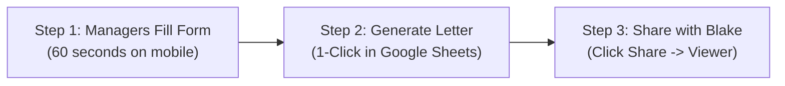

# TAMHA Team Bank Account Authorization: 3-Step Standard Operating Procedure

A dead-simple, 3-step workflow for the **TAMHA VP Finance (Joe Zappia)** and team managers to collect signing officer information, automate official letterhead letters, and authorize accounts with **Blake Giroux** at **Mosaik Credit Union**.

---

## ⚡ The 3-Step Workflow at a Glance

---

## Step 1: Team Managers Fill Out the 60-Second Form

Instead of emailing messy text snippets, managers or treasurers complete the official intake form:

👉 **[TAMHA Team Bank Account Signer Intake Form](https://docs.google.com/forms/d/19KlBkgZ-YiAcxqpsXk-KPW9Ud8RgKGBi9l2Nf4iTpz4/viewform)**

1. **Select Team:** Pick the team from the official directory (covers U7 through U18, plus an "Other" option for newly added teams).
2. **Enter Signers:** Provide full legal names, positions, cell phone numbers, and email addresses for:
   * **Primary Signer** (Manager, Treasurer, or Coach)
   * **Secondary Signer** (Mandatory dual signer)
   * **Third Signer** (Optional backup signer)
3. **Submit:** Takes under 60 seconds on mobile or desktop. 
4. **Live Synchronization:** The submission immediately streams into the **`Form Responses 1`** tab of the Master Google Sheet.

---

## Step 2: 1-Click Document Generation in Google Sheets

When you want to process submitted teams, open the live dashboard:

👉 **[TAMHA Team Banking & Finance Master Dashboard](https://docs.google.com/spreadsheets/d/1Icy9K5DV_9ymCm3vKqc6CdLgsfv0NTS5M_dTTdKvR0A/edit)**

1. In the top Google Sheets menu bar, click:  
   **`🏒 TAMHA Banking` $\rightarrow$ `⚡ Generate Bank Letters for Pending Teams`**

2. The system automatically:
   * Copies the official TAMHA letterhead template with the Bearcats crest.
   * Merges the team name, account reference, legal names, and contact details.
   * Generates the styled Google Doc in Google Drive.
   * Pastes the direct document link right into the **Authorization Letter** column (Column X).

---

## Step 3: Open the Letter & Share Directly with Blake Giroux

You can share the authorization letter directly via Google Drive (preferred), or export it as a standard PDF:

### Option A: Direct Drive Share (Recommended — Fastest)
1. Click the generated document link in the sheet to open the official letter in Google Docs.
2. In the top right corner, click the blue **Share** button.
3. In the text box, type **`Blake Giroux`** (`BGiroux@mosaikcu.ca`).
4. Ensure access is set to **Viewer**, and click **Done / Send**.

5. **Done!** Blake instantly receives access to the official letter and initiates remote DocuSign signing for the team staff.

### Option B: Download & Email as PDF
If Blake or Mosaik Credit Union prefers an email attachment:
1. In the open Google Doc, click **File** $\rightarrow$ **Download** $\rightarrow$ **PDF Document (.pdf)**.
2. Attach the generated `.pdf` file to an email to `BGiroux@mosaikcu.ca`.

---

## 🏆 Summary of Benefits

* **Zero Back-and-Forth:** Eliminates missing phone numbers and nickname confusion.
* **No Manual Retyping:** No copy-pasting from emails into Word docs while traveling.
* **Oct 30 Budget Ready:** The exact same spreadsheet already contains tracking columns for preliminary budget submissions.
* **Privacy & Governance (Policy 2.7):** All sensitive banking details and phone numbers remain strictly secured inside TAMHA's official Google Workspace.
