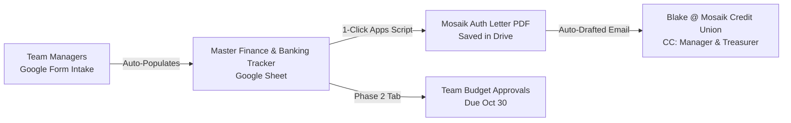

# TAMHA Team Banking & Signer Authorization Workflow (Google Workspace)

A streamlined, paperless workflow built inside the **TAMHA Google Workspace** (`@trurominorhockey.ca`) to eliminate email back-and-forth for bank letters, centralize signer records, and automate authorization letters to Mosaik Credit Union (Truro Branch).

---

## 1. Executive Summary & Problem Context

Every October, TAMHA undergoes a massive bottleneck around team bank accounts:
1. **The Inbound Bottleneck:** 15–20 team managers email `vpfinance@trurominorhockey.ca` with unstructured, partial signer details (missing phone numbers, nicknames, missing secondary signers).
2. **Manual Letter Creation:** The VP Finance must manually look up past account details, paste names into a Word document on TAMHA letterhead, export PDFs, and individually email or drop them off to the bank contact (**Blake** at **Mosaik Credit Union**).
3. **Tracking & Compliance Blindspots:** There is often no single live dashboard tracking which teams have submitted, which letters are at the bank, who the signers are, or account numbers.
4. **Follow-On Strain (Budgets):** By October 30th, the exact same teams must submit preliminary team budgets to VP Finance, creating a second wave of unstructured emails.

### The Solution: A Lightweight 3-Piece Google Workspace System

### Live Demo Assets (Deployed under `u13amgr@trurominorhockey.ca`):
* **Live Form (Responder View):** [TAMHA 2026–2027 Team Bank Account Signer Intake](https://docs.google.com/forms/d/19KlBkgZ-YiAcxqpsXk-KPW9Ud8RgKGBi9l2Nf4iTpz4/viewform)
* **Form (Editor View):** [Edit Intake Form](https://docs.google.com/forms/d/19KlBkgZ-YiAcxqpsXk-KPW9Ud8RgKGBi9l2Nf4iTpz4/edit)
* **Master Tracking Sheet:** [[DEMO] TAMHA 2026-2027 Team Banking & Finance Master Dashboard](https://docs.google.com/spreadsheets/d/1Icy9K5DV_9ymCm3vKqc6CdLgsfv0NTS5M_dTTdKvR0A/edit)
* **Master Letterhead Template (Zero PII):** [TEMPLATE - TAMHA Mosaik Credit Union Authorization Letter](https://docs.google.com/document/d/17l_LiSP0Uz9ZaF5gHg-_urMNO70JtfPMr0KMkrXjmDQ/edit)
* **Sample Filled Letter Doc:** [[DEMO] TAMHA Mosaik Credit Union Authorization Letter - U13A Bearcats](https://docs.google.com/document/d/1OdsNRFR2dsYnnm46adaPyq6z1OBNSZw4RZq2VDJxRmg/edit)
* *Note: Direct Writer permissions granted to `vpfinance@trurominorhockey.ca`.*

---

## 2. Component 1: Google Form Intake

Create a form inside TAMHA Workspace: **`TAMHA 2026–2027 Team Bank Account & Signer Registration`**.

### Form Structure:
* **Section 1: Team Identification**
  * `Team Division & Level` *(Dropdown: U7, U9, U11C, U11A, U11AA, U13C, U13A, U15C, U15A, U15AA, U18C, U18AA, etc.)*
  * `Head Coach Name` *(Short answer)*
* **Section 2: Primary Signing Officer (Manager or Treasurer)**
  * `Full Legal Name` *(As shown on government ID for credit union verification)*
  * `Team Role` *(Dropdown: Team Manager, Treasurer)*
  * `Official Email Address` *(e.g., u13amgr@trurominorhockey.ca or personal)*
  * `Cell Phone Number` *(For credit union verification)*
* **Section 3: Secondary Signing Officer (Mandatory)**
  * `Full Legal Name`
  * `Team Role` *(Dropdown: Treasurer, Team Manager, Head Coach)*
  * `Email Address`
  * `Cell Phone Number`
* **Section 4: Third Signing Officer (Optional / Recommended Backup)**
  * `Full Legal Name`
  * `Team Role` *(Dropdown: Head Coach, Assistant Coach, Safety)*
  * `Email Address`
  * `Cell Phone Number`
* **Section 5: Account Notes**
  * `Account Status` *(Multiple Choice: Existing TAMHA Account from Last Season / Need Account Details / New Account)*
  * `Previous Year Team Name / Notes` *(Short answer)*

---

## 3. Component 2: Master Finance & Banking Tracker (Google Sheet)

The Google Form links directly to a Master Sheet in Joe's private `TAMHA Finance` Drive:

### Sheet Tabs & Architecture:
The Master Spreadsheet is organized into three connected tabs:
1. **`Form Responses 1`**: Live destination streaming responses directly from the Google Form intake.
2. **`Team Banking & Signers`**: Clean executive dashboard showing all teams, dual signers, account numbers, and direct authorization letter links.
3. **`Mosaik Account Directory`**: Internal reference table matching all 28 official TAMHA teams to their private 9-digit Mosaik Credit Union account numbers. The automation engine bridges to this sheet to pull account numbers without exposing them to public responders.

### Master Dashboard Columns:
| Col | Header | Purpose / Formula |
|---|---|---|
| A | `Timestamp` | Submission date / timestamp |
| B | `Division & Team` | Team division & level (e.g., `U11 AA Bearcats`, `U13 A Bearcats`) |
| C–F | `Signer 1 (Primary - Manager)` | Name, Role, Phone, Email |
| G–J | `Signer 2 (Secondary - Treasurer)` | Name, Role, Phone, Email |
| K–N | `Signer 3 (Coach / Backup)` | Name, Role, Phone, Email |
| O | `Account Notes / Exceptions` | Rollover status or special notes |
| P | `Mosaik Account #` | 9-digit credit union account number (auto-looked up from directory) |
| Q | `Banking Status` | Status: `Ready / Share with Blake` |
| R | `Authorization Letter (Blake / DocuSign)` | Direct Google Doc viewer link for Blake Giroux |
| S | `Oct 30 Budget Status` | Status: `[Not Submitted | In Progress | Approved]` |
| T | `Team Budget Link` | Link to preliminary team operating budget |

---

## 4. Component 3: Google Doc Letterhead Template & Apps Script

### Template: `TEMPLATE - Mosaik Credit Union Authorization Letter`
Placeholders inside the template:
- `{{DATE}}`
- `{{TEAM_NAME}}`
- `{{ACCOUNT_NUMBER}}`
- `{{SIGNER_1_NAME}}`, `{{SIGNER_1_ROLE}}`, `{{SIGNER_1_PHONE}}`, `{{SIGNER_1_EMAIL}}`
- `{{SIGNER_2_NAME}}`, `{{SIGNER_2_ROLE}}`, `{{SIGNER_2_PHONE}}`, `{{SIGNER_2_EMAIL}}`
- `{{SIGNER_3_NAME}}`, `{{SIGNER_3_ROLE}}`, `{{SIGNER_3_PHONE}}`, `{{SIGNER_3_EMAIL}}`

---

## 5. Automated Google Apps Script (V2 — Dynamic Header & Directory Integration)

The production Apps Script is saved in the repository at [`templates/TAMHA_Bank_Letter_Apps_Script.js`](file:///c:/Users/redmo/OneDrive/Documents/GitRepos/tamha-manager-docs/templates/TAMHA_Bank_Letter_Apps_Script.js).

Key architectural upgrades in V2:
1. **Dynamic Header Resolution:** Searches row 1 for header names instead of using static column indices, preventing any column offset issues if columns are added or shifted.
2. **Mosaik Account Directory Lookup:** Automatically queries the `Mosaik Account Directory` tab to inject the official 9-digit account number into `{{ACCOUNT_NUMBER}}`.
3. **Works Across Both Sheets:** Functions seamlessly on either `Team Banking & Signers` or `Form Responses 1`.

---

## 6. How This Connects to Preliminary Budgets (Due Oct 30)

Once the banking workflow is established:
1. Team managers have their Google Sheet Budget Template copied from `TAMHA Manager's Desk`.
2. When submitting their budget before October 30th, they paste the view-only link into a follow-up form or email.
3. Joe tracks budget approval in Column J of the very same dashboard.
4. Joe has a complete financial ledger for all teams from day 1 to end of season.
