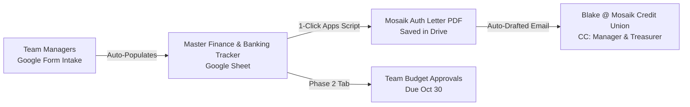

# TAMHA Team Banking & Signer Authorization Workflow (Google Workspace)

A streamlined, paperless workflow built inside the **TAMHA Google Workspace** (`@trurominorhockey.ca`) to eliminate email back-and-forth for bank letters, centralize signer records, and automate authorization letters to Mosaik Credit Union (Truro Branch).

---

## 1. Executive Summary & Problem Context

Every October, TAMHA undergoes a massive bottleneck around team bank accounts:
1. **The Inbound Bottleneck:** 15–20 team managers email `vpfinance@trurominorhockey.ca` with unstructured, partial signer details (missing phone numbers, nicknames, missing secondary signers).
2. **Manual Letter Creation:** The VP Finance must manually look up past account details, paste names into a Word document on TAMHA letterhead, export PDFs, and individually email or drop them off to the bank contact (**Blake** at **Mosaik Credit Union**).
3. **Tracking & Compliance Blindspots:** There is often no single live dashboard tracking which teams have submitted, which letters are at the bank, who the signers are, or account numbers.
4. **Follow-On Strain (Budgets):** By October 30th, the exact same teams must submit preliminary team budgets to VP Finance, creating a second wave of unstructured emails.

### The Solution: A Lightweight 3-Piece Google Workspace System


### Live Demo Assets (Deployed under `u13amgr@trurominorhockey.ca`):
* **Live Form (Responder View):** [TAMHA 2026–2027 Team Bank Account Signer Intake](https://docs.google.com/forms/d/19KlBkgZ-YiAcxqpsXk-KPW9Ud8RgKGBi9l2Nf4iTpz4/viewform)
* **Form (Editor View):** [Edit Intake Form](https://docs.google.com/forms/d/19KlBkgZ-YiAcxqpsXk-KPW9Ud8RgKGBi9l2Nf4iTpz4/edit)
* **Master Tracking Sheet:** [[DEMO] TAMHA 2026-2027 Team Banking & Finance Master Dashboard](https://docs.google.com/spreadsheets/d/1Icy9K5DV_9ymCm3vKqc6CdLgsfv0NTS5M_dTTdKvR0A/edit)
* **Master Letterhead Template (Zero PII):** [TEMPLATE - TAMHA Mosaik Credit Union Authorization Letter](https://docs.google.com/document/d/17l_LiSP0Uz9ZaF5gHg-_urMNO70JtfPMr0KMkrXjmDQ/edit)
* **Sample Filled Letter Doc:** [[DEMO] TAMHA Mosaik Credit Union Authorization Letter - U13A Bearcats](https://docs.google.com/document/d/1OdsNRFR2dsYnnm46adaPyq6z1OBNSZw4RZq2VDJxRmg/edit)
* *Note: Direct Writer permissions granted to `vpfinance@trurominorhockey.ca`.*


---

## 2. Component 1: Google Form Intake

Create a form inside TAMHA Workspace: **`TAMHA 2026–2027 Team Bank Account & Signer Registration`**.

### Form Structure:
* **Section 1: Team Identification**
  * `Team Division & Level` *(Dropdown: U7, U9, U11C, U11A, U11AA, U13C, U13A, U15C, U15A, U15AA, U18C, U18AA, etc.)*
  * `Head Coach Name` *(Short answer)*
* **Section 2: Primary Signing Officer (Manager or Treasurer)**
  * `Full Legal Name` *(As shown on government ID for credit union verification)*
  * `Team Role` *(Dropdown: Team Manager, Treasurer)*
  * `Official Email Address` *(e.g., u13amgr@trurominorhockey.ca or personal)*
  * `Cell Phone Number` *(For credit union verification)*
* **Section 3: Secondary Signing Officer (Mandatory)**
  * `Full Legal Name`
  * `Team Role` *(Dropdown: Treasurer, Team Manager, Head Coach)*
  * `Email Address`
  * `Cell Phone Number`
* **Section 4: Third Signing Officer (Optional / Recommended Backup)**
  * `Full Legal Name`
  * `Team Role` *(Dropdown: Head Coach, Assistant Coach, Safety)*
  * `Email Address`
  * `Cell Phone Number`
* **Section 5: Account Notes**
  * `Account Status` *(Multiple Choice: Existing TAMHA Account from Last Season / Need Account Details / New Account)*
  * `Previous Year Team Name / Notes` *(Short answer)*

---

## 3. Component 2: Master Finance & Banking Tracker (Google Sheet)

The Google Form links directly to a Master Sheet in Joe's private `TAMHA Finance` Drive:

### Sheet Columns:
| Col | Header | Purpose / Formula |
|---|---|---|
| A | `Timestamp` | Auto-captured submission date |
| B | `Team` | Team division & level |
| C | `Head Coach` | Coach contact |
| D | `Signer 1 (Primary)` | Name, Role, Phone, Email |
| E | `Signer 2 (Secondary)` | Name, Role, Phone, Email |
| F | `Signer 3 (Backup)` | Name, Role, Phone, Email |
| G | `Mosaik Account #` | Permanent internal record for TAMHA |
| H | `Status` | Dropdown: `[Pending Review | Letter Generated | Sent to Bank (Blake) | Card Signed / Active]` |
| I | `Letter Drive Link` | Direct link to generated PDF letter in Google Drive |
| J | `Oct 30 Budget Status` | Dropdown: `[Not Submitted | In Review | Approved]` |

---

## 4. Component 3: Google Doc Letterhead Template & Apps Script

### Template: `TEMPLATE - Mosaik Credit Union Authorization Letter`
Placeholders inside the template:
- `{{DATE}}`
- `{{TEAM_NAME}}`
- `{{ACCOUNT_NUMBER}}`
- `{{SIGNER_1_NAME}}`, `{{SIGNER_1_ROLE}}`, `{{SIGNER_1_PHONE}}`, `{{SIGNER_1_EMAIL}}`
- `{{SIGNER_2_NAME}}`, `{{SIGNER_2_ROLE}}`, `{{SIGNER_2_PHONE}}`, `{{SIGNER_2_EMAIL}}`
- `{{SIGNER_3_NAME}}`, `{{SIGNER_3_ROLE}}`, `{{SIGNER_3_PHONE}}`, `{{SIGNER_3_EMAIL}}`
- `{{VP_FINANCE_NAME}}` (Joe Zappia)

### Letter Content Body:
```text
TRURO AREA MINOR HOCKEY ASSOCIATION (TAMHA)
P.O. Box 181, Truro, NS B2N 5C1
vpfinance@trurominorhockey.ca

[DATE]

To: Mosaik Credit Union (Truro Branch)
Attn: Commercial / Community Accounts (Blake)

RE: Signing Officer Authorization — Truro Bearcats [TEAM_NAME] (Account: [ACCOUNT_NUMBER])

Please accept this letter as official authorization on behalf of the Truro Area Minor Hockey Association (TAMHA) Executive to update the designated signing officers for the above-referenced team account for the 2026–2027 hockey season.

Effective immediately, the following individuals are authorized as signing officers with full operational privileges (including dual-authorization online banking, deposits, withdrawals, and cheque issuance):

1. Primary Signer:
   Name: [SIGNER_1_NAME]
   Position: [SIGNER_1_ROLE]
   Phone: [SIGNER_1_PHONE]
   Email: [SIGNER_1_EMAIL]

2. Secondary Signer:
   Name: [SIGNER_2_NAME]
   Position: [SIGNER_2_ROLE]
   Phone: [SIGNER_2_PHONE]
   Email: [SIGNER_2_EMAIL]

3. Additional Signer:
   Name: [SIGNER_3_NAME]
   Position: [SIGNER_3_ROLE]
   Phone: [SIGNER_3_PHONE]
   Email: [SIGNER_3_EMAIL]

All transactions require two (2) authorized signatures. Please remove any prior season signing officers not listed above.

Sincerely,

Joe Zappia
Vice President of Finance
Truro Area Minor Hockey Association (TAMHA)
vpfinance@trurominorhockey.ca
```

---

## 5. Automated Google Apps Script (1-Click Generation)

In the Master Google Sheet, click **Extensions > Apps Script** and paste:

```javascript
function onOpen() {
  SpreadsheetApp.getUi()
    .createMenu('TAMHA Banking')
    .addItem('Generate Bank Letter for Selected Row', 'generateSelectedBankLetter')
    .addToUi();
}

const TEMPLATE_DOC_ID = 'YOUR_GOOGLE_DOC_TEMPLATE_ID';
const OUTPUT_FOLDER_ID = 'YOUR_DRIVE_FOLDER_ID_FOR_BANK_LETTERS';

function generateSelectedBankLetter() {
  const sheet = SpreadsheetApp.getActiveSpreadsheet().getActiveSheet();
  const row = sheet.getActiveCell().getRow();
  if (row <= 1) {
    SpreadsheetApp.getUi().alert('Please select a team data row.');
    return;
  }

  const team = sheet.getRange(row, 2).getValue();
  const s1Name = sheet.getRange(row, 4).getValue();
  const s2Name = sheet.getRange(row, 5).getValue();
  const s3Name = sheet.getRange(row, 6).getValue();
  const acct = sheet.getRange(row, 7).getValue() || 'On File';

  // 1. Copy Template
  const templateFile = DriveApp.getFileById(TEMPLATE_DOC_ID);
  const folder = DriveApp.getFolderById(OUTPUT_FOLDER_ID);
  const copyDoc = templateFile.makeCopy('Bank_Letter_' + team + '_2026-2027', folder);
  const doc = DocumentApp.openById(copyDoc.getId());
  const body = doc.getBody();

  // 2. Replace Tokens
  body.replaceText('{{DATE}}', Utilities.formatDate(new Date(), 'America/Halifax', 'MMMM d, yyyy'));
  body.replaceText('{{TEAM_NAME}}', team);
  body.replaceText('{{ACCOUNT_NUMBER}}', acct);
  body.replaceText('{{SIGNER_1_NAME}}', s1Name);
  body.replaceText('{{SIGNER_2_NAME}}', s2Name);
  body.replaceText('{{SIGNER_3_NAME}}', s3Name || 'N/A');

  doc.saveAndClose();

  // 3. Convert to PDF
  const pdf = copyDoc.getAs('application/pdf');
  const pdfFile = folder.createFile(pdf).setName('TAMHA_Bank_Letter_' + team + '_2026-2027.pdf');
  copyDoc.setTrashed(true); // clean up intermediate doc

  // 4. Update Sheet with link and status
  sheet.getRange(row, 8).setValue('Letter Generated');
  sheet.getRange(row, 9).setValue(pdfFile.getUrl());

  SpreadsheetApp.getUi().alert('Letter generated successfully! Saved in Drive:\n' + pdfFile.getUrl());
}
```

---

## 6. How This Connects to Preliminary Budgets (Due Oct 30)

Once the banking workflow is established:
1. Team managers have their Google Sheet Budget Template copied from `TAMHA Manager's Desk`.
2. When submitting their budget before October 30th, they paste the view-only link into a follow-up form or email.
3. Joe tracks budget approval in Column J of the very same dashboard.
4. Joe has a complete financial ledger for all teams from day 1 to end of season.
