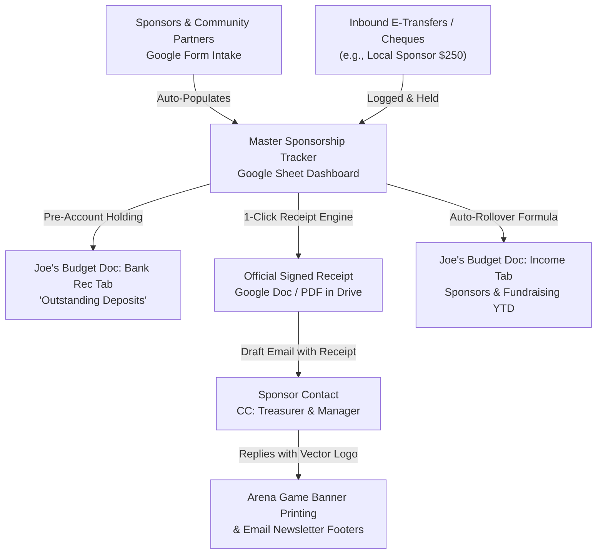

# TAMHA Team Sponsorship, Fundraising & Budget Tracking System

A complete, paperless Google Workspace workflow built for **Truro Area Minor Hockey Association (TAMHA)** team managers and treasurers to intake sponsorships, track funds, flag special allocations (*"to be used for rep fees"*, *"would like to sponsor apparel"*), collect print-ready vector logos for arena banners, issue official receipts, and smoothly capture totals in **Joe Zappia's Official Team Budget Template**.

---

## 1. Executive Summary & Architecture

As the hockey season kicks off, sponsorships and team fundraising (e-transfers, cheques, 50/50 raffle sales, bottle drives) start arriving before team bank accounts are fully authorized at Mosaik Credit Union. 

This creates four distinct operational needs for team treasurers and managers:
1. **Intake & Structured Data:** Standardize sponsor intake so businesses submit proper legal names, billing addresses, contact details, and special instructions.
2. **Pre-Account Fund Holding:** Safely track inbound e-transfers and cheques while team bank letters and dual-signer authorizations are being processed by Mosaik Credit Union.
3. **Banner Logo Assets:** Collect vector (`.AI`, `.EPS`, `.PDF`, `.SVG`) or high-res artwork suitable for large-format physical arena banner printing and weekly email footers.
4. **Receipting & Budget Reconciliation:** Automatically issue signed corporate sponsorship receipts and map figures directly into **Joe Zappia's Team Budget Template** (`Income`, `Expenses`, `Budget`, and `Bank Rec` tabs).

### The Lightweight 4-Piece System:


---

## 2. Live Deployed Assets & Access Links

All core assets have been created and deployed under the official team environment (`u13amgr@trurominorhockey.ca`):

| Asset | Type | Public / Responder Link | Editor / Management Link |
|---|---|---|---|
| **Sponsorship Intake Form (Template)** | Google Form | [Fill Out Intake Form](https://docs.google.com/forms/d/1uQZJGuRV034DeS8VRfVB77kHOmcvBcCjC0giCtKp4Ow/viewform) | [Edit Google Form](https://docs.google.com/forms/d/1uQZJGuRV034DeS8VRfVB77kHOmcvBcCjC0giCtKp4Ow/edit) |
| **Master Sponsorship Dashboard (Template)** | Google Sheet | [View Master Sheet Dashboard](https://docs.google.com/spreadsheets/d/1-CeD82kxqh-lnAxpUWA4ypEiQNg8ZX_2kdEIh_hPyek/edit) | Full Editor Access (Includes Dropdowns) |
| **Shared Sponsor Logos Drive Folder** | Google Drive | [Open Shared Artwork Folder](https://drive.google.com/drive/folders/1fychCbsPcfm7RhGzmbeFwkhPpWYL4cED) | Direct Uploads for Vector Logos (.AI, .EPS, .PDF) |
| **Generic Form Header Banner (PNG)** | Image File | [View Header Banner in Drive](https://drive.google.com/file/d/1s-e4UWDVOKqDLvd2rypomkEQ3SqzRWSF/view) | Generic 1600x400 (No Team / No Year) |
| **Sample Live Receipt Doc (#001)** | Google Doc | [View Sample Receipt Doc](https://docs.google.com/document/d/1zzCst9WQK6U9BfSEHUrPZu4Cv79VgPBq686HnI7lhls/edit) | Auto-Generated Google Doc |
| **Gmail Draft Thank-You & Logo Request** | Gmail Draft | *In Team Drafts Folder* | Ready for Treasurer/Manager review |

---

## 3. Component 1: Google Form Intake Structure (Internal Staff Intake)

The Google Form is designed as an **internal intake tool** for Team Treasurers, Sponsorship Coordinators, and Managers when a sponsorship or fundraising commitment is confirmed. It also includes an exact copy-paste outreach message that team staff can copy directly into emails or text messages when requesting details from prospective business partners.

### Form Sections:
1. **Welcome & Staff Purpose:**
   * Clarifies internal operational purpose: collecting billing info, flagging custom allocations, gathering vector logos, and issuing receipts.
   * **Includes Copy-Paste Outreach Template:** Formatted message ready to send to prospective sponsors requesting their details and vector logo.
2. **Team Identification (Strict Dropdown):**
   * `Team Division & Level` *(Dropdown: U7, U9, U11C, U11B, U11A, U11AA, U13C, U13B, U13A, U13AAA, U15C, U15A, U15AA, U18C, U18AA, TAMHA General, Other)*
   * `Other Team Specification` *(Short answer)*
   * `Connected Player / Family Referral` *(Zero PII: Generic helper text "e.g., Player Name, or leave blank for general outreach")*
3. **Sponsor & Business Contact Information:**
   * `Legal Business / Organization Name` *(Required for official receipt records)*
   * `Display / Banner Name` *(Optional: how the company name should read on the banner)*
   * `Primary Contact Person & Title` *(e.g., Contact Name, Owner / Director)*
   * `Contact Email Address` *(Required for emailing receipts and banner proofs)*
   * `Contact Phone Number` *(Direct phone for quick check-ins)*
   * `Business Civic / Mailing Address` *(Required for corporate expense receipting)*
   * `Website URL & Social Media Handles` *(For team website links & sponsor shoutouts)*
4. **Sponsorship Tier & Financial Commitment:**
   * `Sponsorship Package / Tier` *(Dropdown: Title $1,000, Premium $500, Main $250, Community Friend $100, Custom, In-Kind)*
   * `Total Contribution Amount ($ CAD)` *(Validated currency amount)*
   * `Payment Method` *(Dropdown: Interac E-Transfer, Cheque, Cash, In-Kind)*
   * `Payment Status & Pre-Account Holding` *(Dropdown: Held Pre-Account, Deposited to Mosaik, In Transit, Awaiting Invoice, Pledged)*
   * `Payment Reference Details` *(Password, cheque #, or sender name)*
5. **Fund Direction & Special Directives (CRITICAL):**
   * `Fund Allocation Directive` *(Dropdown)*:
     * **General Team Operating Fund** *(Standard: Reduces registration/tournament costs equally for all players)*
     * **Directed: Specific Player Rep Fee Offset** *(e.g. "to be used for rep fees")*
     * **Directed: Team Apparel / Practice Jerseys / Tracksuits** *(e.g. "would like to sponsor apparel")*
     * **Directed: Tournament Entry Fees & Travel Ice**
     * **Other / Custom Allocation**
   * `Special Instructions & Notes` *(Paragraph field for sponsor stipulations)*
6. **Logo Collection & Shared Google Drive Folder:**
   * Explains **Vector formats (`.AI`, `.EPS`, `.PDF`, `.SVG`)** for large physical arena banners vs **Raster images** for email footers/web.
   * Direct clickable link to the **Shared Google Drive Folder** (`https://drive.google.com/drive/folders/1fychCbsPcfm7RhGzmbeFwkhPpWYL4cED`).
   * `Logo Artwork Delivery Status` *(Checkboxes: Vector uploaded to Drive, High-res raster uploaded to Drive, Received via email, Typography only, Logo pending)*
   * `Direct Link to Uploaded Logo File` *(Optional Google Drive file URL)*
   * `Official Sponsorship Receipt Status` *(Dropdown: Receipt Required, Receipt Already Issued, Pending Payment, No Receipt Requested)*

---

## 4. Component 2: Master Sponsorship Tracker (Google Sheet)

The Master Tracking Spreadsheet (`1-CeD82kxqh-lnAxpUWA4ypEiQNg8ZX_2kdEIh_hPyek`) contains three purpose-built tabs:

### Tab 1: `Sponsorship Tracker`
Comprehensive ledger tracking each inbound sponsor:
* **Col A–H:** Timestamp, Team, Business Legal Name, Banner Display Name, Contact Name, Email, Phone, Mailing Address.
* **Col I–K:** Sponsorship Tier, Amount ($ CAD), Payment Method.
* **Col L:** **Holding / Deposit Status** (`Held Pre-Account`, `Deposited to Mosaik Credit Union`, `Pending`).
* **Col M–N:** **Allocation Preference** (`General Operating`, `Rep Fee Offset`, `Apparel Sponsor`) and **Special Instructions**.
* **Col O:** Player Referral Connection.
* **Col P:** **Logo Status** (`Awaiting Vector`, `Received High-Res`, `Ready for Banner Print`).
* **Col Q–S:** Receipt #, Receipt Status, and Mapped Budget Line Item.

### Tab 2: `Budget Sync (Joe's Template)`
Direct summary bridging into **Joe Zappia's Official Team Budget Template** (`Team_Budget_Template.xlsx`):
* **Sponsorship Tiers Summary:**
  * Title Sponsor ($1,000) &rarr; Bridges to *"Major Corporate Sponsor"* (Row 9 of Joe's Budget tab)
  * Premium Sponsor ($500) &rarr; Bridges to *"$500 Banner ads (Gold)"* (Row 10 of Joe's Budget tab)
  * Main Sponsor ($250) &rarr; Bridges to *"$250 Banner ads (Silver)"* (Row 11 of Joe's Budget tab) *(Currently 1: Reformed Studio)*
  * Community Friend ($100) &rarr; Bridges to *"$100 Banner ads (Bronze)"* (Row 12 of Joe's Budget tab)
* **Fundraising Initiatives:**
  * Halloween 50/50 Draw (Projected Net: $1,080.00 | Actual Collected)
  * Team Bottle Drive (John Ross & Sons Account)
* **Bank Reconciliation & Cash Holding Balance:**
  * Total Funds Received to Date
  * Deposited to Mosaik Credit Union
  * **Held Pre-Account (Uncashed/Pending Claim):** Directly mirrors *"Outstanding deposits"* on Joe's **`Bank Rec`** tab!
* **Special Allocations Audit:**
  * Total General Operating Fund vs Player Rep Fee Offsets vs Team Apparel.

### Tab 3: `Receipts & Banner Assets`
Tracks all generated receipt documents, direct Google Doc links, date emailed, logo quality rating, and banner printing slot assignment.

---

## 5. Handling Pre-Account Inflow & Bank Reconciliation

### Why Early E-Transfers Happen:
Sponsors want to contribute immediately before deadlines or when contacted. For example, **Reformed Studio / SPIN Haus** ($250.00 from Shelbie Rae Thompson) sent an Interac e-transfer with password `mainsponsorship`.

### How Team Treasurers Manage This Cleanly:
1. **Holding State in Tracker:** The Treasurer logs the payment in Column L as `Held Pre-Account (Pending Mosaik setup)`.
2. **E-Transfer Acceptance:**
   * E-transfers can remain pending in the inbox or deposited into the official team account the day Mosaik provides live online banking credentials.
   * If an e-transfer expires within 30 days, Interac notifies the sender or allows auto-reminders.
3. **Joe's Budget Doc Reconciliation (`Bank Rec` tab):**
   * In Joe's budget workbook (`Team_Budget_Template.xlsx`), the **`Bank Rec`** tab has a dedicated section:
     ```text
     Row 5:  Balance per Bank:             $0.00
     Row 7:  Outstanding deposits:
     Row 8:    Sponsorships (Pending):     $250.00
     -------------------------------------------
     Row 14: Adjusted Bank Balance:        $250.00
     ```
   * As soon as Blake at Mosaik activates the account and the funds are deposited, Row 5 updates to `$250.00` and Row 8 clears to `$0.00`, maintaining 100% accounting fidelity without any bookkeeping discrepancies.

---

## 6. Logo Collection & Banner Printing Quality Standards

Printing an 8-foot or 10-foot physical arena banner requires vector or extremely high-resolution graphic files. A common trap is sponsors sending low-resolution web thumbnails (72 DPI) copied from Facebook or Instagram, which turn blurry and pixelated when printed.

### Guidance for Treasurers & Team Managers:
| Format Type | File Extensions | Suitability | Action Required |
|---|---|---|---|
| **Vector (Ideal)** | `.AI`, `.EPS`, `.PDF`, `.SVG` | **Perfect** for arena banner printing. Scales to any size with razor-sharp edges. | Send directly to the banner sign shop without alteration. |
| **High-Res Raster** | `.PNG` (transparent background), `.TIFF`, uncompressed `.JPG` (300+ DPI, >2000px wide) | **Good** for email footers, website, and printable after verification. | Can be cleanly upscaled using vector tracing or high-res image enhancement tools. |
| **Low-Res Web/Social** | `.JPG` / `.PNG` (<500px, 72 DPI, heavily compressed screenshots) | **Unusable** for large banners. | Automated follow-up email politely requests vector artwork or contacts their marketing/graphics designer. |

### Digital Footers & Web Placement:
* For weekly manager emails, logos are downscaled to crisp 300px width transparent PNGs and embedded into the email footer block under **"Proudly Supported by our 2026–2027 Team Sponsors"**.

---

## 7. Official Sponsorship Receipt System

### Legal & CRA Status:
Minor hockey associations (TAMHA) are registered non-profit amateur athletic associations under Hockey Nova Scotia and Hockey Canada, not registered charities with 501(c)(3) or 118.1 charitable tax status. 
* Business sponsorships are commercial partnerships in exchange for advertising consideration.
* In Canada, corporate sponsorships are claimable by businesses as **legitimate advertising and promotional business expenses** under **CRA Interpretation Bulletin IT-487**.
* Every official receipt issued includes this exact legal disclaimer, protecting both TAMHA and the sponsor.

### Automated Receipt Generator (`scripts/generate_sponsorship_receipt.py`):
1. **Association Letterhead:** Features the official Truro Bearcats crest (`truro_bearcats_crest.png`).
2. **Unique Serial Number:** e.g., `TAMHA-U13A-SPON-2026-001`.
3. **Dual Officer Signatures:** Team Treasurer and Team Manager.
4. **Permanent Cloud Storage:** Saved directly to Google Drive as an official Google Doc and linked inside the Master Sheet.

---

## 8. Roll-Up into Joe Zappia's Team Budget Template

When submitting the mandatory preliminary budget to Joe Zappia (`vpfinance@trurominorhockey.ca`), the team treasurer transfers the numbers from the `Budget Sync` tab into Joe's Excel/Sheets template (`Team_Budget_Template.xlsx`):

### 1. `Income` Tab (Revenue):
* **Row 9 (Major Corporate):** Total count & amount from Title Sponsors ($1,000).
* **Row 10 (Gold Banner):** Total count & amount from Premium Sponsors ($500).
* **Row 11 (Silver Banner):** Total count & amount from Main Sponsors ($250) &rarr; Currently **`1`** sponsor (`$250.00`).
* **Row 12 (Bronze Banner):** Total count & amount from Community Friends ($100).
* **Row 17 (Fundraising):** Halloween 50/50 Draw sales.

### 2. Handling Special Allocations:
* **"To be used for rep fees":**
  * When a sponsor directs funds to a specific player's rep fees, that amount is credited directly in the player's contribution column on Joe's **`Income`** sheet (`Player 1`, `Player 2`, etc.), reducing that family's cash obligation.
* **"Would like to sponsor apparel":**
  * When a sponsor funds apparel (e.g., practice jerseys or tracksuits), the revenue is entered under dedicated sponsorship, and the matching expenditure is logged under Joe's **`Expenses`** sheet in **`TEAMS ITEMS`** (Row 22–24: *"Team Equipment / Practice Jerseys"*), creating a net-zero cost for the team.

---

## 9. Quick-Action Script Reference

All automation scripts are maintained and executable in the repository:

| Script | Purpose | Command |
|---|---|---|
| `scripts/build_sponsorship_form.py` | Builds & updates the live Google Form intake | `python scripts/build_sponsorship_form.py` |
| `scripts/build_sponsorship_master_sheet.py` | Deploys Master Google Sheet with budget formulas | `python scripts/build_sponsorship_master_sheet.py` |
| `scripts/generate_sponsorship_receipt.py` | Generates official Google Doc receipt for sponsor | `python scripts/generate_sponsorship_receipt.py` |
| `scripts/draft_sponsorship_acknowledgement.py` | Creates Gmail draft thanking sponsor & requesting vector logo | `python scripts/draft_sponsorship_acknowledgement.py` |
| `scripts/sync_sponsorship_responses.py` | Syncs Form responses into Google Sheet | `python scripts/sync_sponsorship_responses.py` |
| `templates/TAMHA_Sponsorship_Apps_Script.js` | Google Sheets custom menu & Apps Script automation | Bound to Master Google Sheet |
