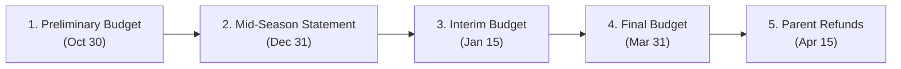

# TAMHA Team Budget & Financial Management Standard Operating Procedure (SOP)

**Truro Area Minor Hockey Association (TAMHA)**  
*Document Ref: TAMHA-SOP-FIN-002 | Season: 2026–2027 | Executive Lead: Joe Zappia (VP Finance)*

---

## 1. Executive Summary & Why the System Was Rebuilt

Every minor hockey team that collects parent fees, solicits corporate sponsorships, or conducts fundraising initiatives is required under **Hockey Nova Scotia (HNS) Regulations** and **TAMHA Policy** to operate under a formal, transparent team budget.

### Problems with the Legacy Template
The legacy TAMHA budget spreadsheet had significant architectural limitations:
1. **Broken Hardcoded Linkages:** Formulas relied on brittle row offsets (`=Income!F9`, `=Expenses!B16`) that produced `#REF!` errors whenever a team added or removed rows.
2. **Misaligned Columns:** Revenue and Expenses were laid out side-by-side with mismatched row heights and misaligned subtotals.
3. **No Bank Reconciliation:** Treasurers lacked an integrated tool to balance credit union bank statements against their operating ledger.
4. **No Player Fee Tracking:** Managers had to maintain separate, disconnected spreadsheets to track jersey deposits, fee installments, and cash calls.

### The New Master Budget System (2026–2027)
The rebuilt **TAMHA Team Budget Master Template** provides an executive-grade, 5-sheet financial operating system designed specifically for volunteer Managers and Treasurers:

*   **Sheet 1: `Budget Summary`** — High-level executive dashboard comparing Projected vs. Actual YTD vs. Variance, dynamically calculating per-player costs and parent out-of-pocket expenses.
*   **Sheet 2: `Income`** — Granular revenue tracker covering Sponsorship Tiers, Team Fundraising Events, Parent Fee Installments, and Jersey Deposits Held in Trust.
*   **Sheet 3: `Expenses`** — Categorized operational cost ledger covering Association Fees ($7,700 Rep Fees, $550 Sweater Fund), Tournaments, Extra Ice & Officials, Apparel, Events, and Bank Fees.
*   **Sheet 4: `Bank Rec`** — Monthly bank reconciliation balancing the Mosaik Credit Union statement against the ledger with automated `$0.00` variance validation.
*   **Sheet 5: `Roster & Fee Tracker`** — Individual 17-player ledger tracking jersey deposit cheques, fee installments, cash calls, and end-of-season return sign-offs.

---

## 2. Official Template Access Links

| Platform | Access Method | Link |
| :--- | :--- | :--- |
| **Google Sheets (Recommended)** | Click to Make a Personal Copy | [**TAMHA Team Budget Master (Google Sheets)**](https://docs.google.com/spreadsheets/d/1W6-_pH7H24ogvHRtxeRjiNFfoL9HHKs6ZtIjBTk_4Z4/copy) |
| **Microsoft Excel (.xlsx)** | Local File in Repository | `templates/TAMHA_Team_Budget_Master_Template.xlsx` |

---

## 2.1 Distribution Models & Reporting Architecture

### Preferred Model: Centralized Pre-Population by VP Finance (Joe Zappia)
To ensure association-wide financial oversight and streamline milestone submissions, the preferred operational workflow is:
1. **Automated Generation:** Using verified submissions from the Bank Signer Intake Form and the Mosaik account mapping ledger, VP Finance generates a dedicated, pre-populated Google Sheet for each of the 28 TAMHA teams in a central Drive directory (`TAMHA 2026-2027 Team Budgets`).
2. **Pre-Populated Data:**
   * Team Name, Division, and Tier (Rep vs C-League).
   * Authorized Signing Officers (Head Coach, Manager, Treasurer) and contact details.
   * Official 9-digit Mosaik Credit Union Account #.
   * Baseline Association Fees (Rep Fees & Sweater Fund for Rep teams; $0 Rep fees for C teams).
3. **Delegated Access:** VP Finance shares each team sheet directly with that team's Manager and Treasurer with **Editor** permissions.
4. **Association Scraping & Reporting:** Because VP Finance retains primary ownership of all 28 team sheets within the TAMHA Google Workspace, an automated aggregation script or `IMPORTRANGE` dashboard can scrape high-level budget figures across all 28 teams in seconds—providing instant association-wide cash position and solvency audits without chasing down individual file attachments.

### Alternative / Fallback: Self-Service Manager Copy
If preferred, managers can click the [**Make a Copy**](https://docs.google.com/spreadsheets/d/1W6-_pH7H24ogvHRtxeRjiNFfoL9HHKs6ZtIjBTk_4Z4/copy) link on the Manager's Desk Resources hub to clone a blank template into their own personal or team Google Drive.

### Key Consideration: Rep Teams vs. C-League (House) Teams
* **Rep Teams (AAA / AA / A / B):**
  * Pay mandatory TAMHA Rep Fees (typically split across two equal installments: Nov 15 and Jan 31).
  * Pay the mandatory TAMHA Sweater Fund contribution ($550).
  * Collect $150/player Jersey Deposits (held in trust).
  * Incur larger tournament entry fees, exhibition ice costs, and ref/timekeeper cash payouts.
* **C-League / House Teams:**
  * **Do NOT pay Rep fees** (core ice time and league operations are covered by base TAMHA player registration).
  * Rep fee rows default to `$0.00`.
  * Collect lower jersey deposits ($50/player).
  * Operating budgets focus on tournament entry, extra exhibition/practice ice, apparel/socks, and team activities/year-end events.

---

## 3. Season Milestones & Submission Deadlines

TAMHA enforces five strict financial reporting milestones throughout the season:

| Milestone | Target Date | Audience | Description & Requirements |
| :--- | :--- | :--- | :--- |
| **Milestone 1** | **October 30** | Parents & VP Finance | **Preliminary Team Budget:** Presented at introductory parent meeting and approved by >75% majority vote. Submitted to `vpfinance@trurominorhockey.ca`. |
| **Milestone 2** | **December 31** | Parent Group | **Mid-Season Financial Statement:** Interim ledger update shared with all parents showing funds raised, expenses paid, and remaining balance. |
| **Milestone 3** | **January 15** | VP Finance | **Interim Budget Submission:** Submitted to VP Finance to verify second Rep Fee installment ($3,850) and second-half solvency. |
| **Milestone 4** | **March 31** | VP Finance | **Final Year-End Budget & Bank Rec:** Complete reconciled financial statement submitted to VP Finance prior to season closeout. |
| **Milestone 5** | **April 15** | Parent Group | **Final Statement & Jersey Deposit Returns:** Final statement distributed to parents. All uncashed jersey deposit cheques returned/destroyed upon return of game sweaters. |

---

## 4. Sheet-by-Sheet Operating Guide

### Sheet 1: `Budget Summary`
*   **Metadata Input (Rows 4–7):** Enter your Team Name, Tier (Rep vs House), Staff names, Mosaik Account #, and Roster Size (default `17`). The Roster Size cell (`G4`) drives all per-player calculations across the workbook.
*   **KPI Cards (Rows 8–9):** Display total projected revenue, actual revenue, total expenses, and the net cash position.
*   **Section 1.0 (Revenue Rollup):** Automatically pulls subtotals from the `Income` tab.
*   **Section 2.0 (Expense Rollup):** Automatically pulls subtotals from the `Expenses` tab.
*   **Section 3.0 (Per-Player Breakdown):**
    *   *Gross Cost Per Player:* Total team budget divided by roster count.
    *   *Fundraising/Sponsor Subsidy:* Dollars raised per player from non-parent sources.
    *   *Net Parent Fee Per Player:* True out-of-pocket cost per family.

### Sheet 2: `Income`
*   **1.0 Sponsorships:** Track Major ($1,000+), Gold ($500), Silver ($250), and Bronze ($100) sponsors. Track payment method and whether a sponsor receipt was issued.
*   **2.0 Fundraising:** Enter planned events (Bottle Drive, 50/50, Grand in Your Hand). Enter Projected Net vs. Actual Net after expenses.
*   **3.0 Parent Contributions:** Calculate Rep Fee installments ($226.47 x 17 = $3,850 per installment) and team cash calls.
*   **4.0 Jersey Deposits (Held in Trust):** Track the $150/player Rep deposit ($50 House). **Crucial Rule:** Jersey deposits are liability trust funds—they must NOT be spent on team operating costs.
*   **5.0 Miscellaneous & Interest:** Record bank interest or account credits.

### Sheet 3: `Expenses`
*   **1.0 Association Fees:**
    *   TAMHA Rep Fees: $7,700 total (Installment 1: $3,850 on Nov 15; Installment 2: $3,850 on Jan 31).
    *   Mandatory Sweater Fund: $550 contribution per team (Nov 15).
    *   Playoff Assessments: Regional/Provincial play entry fees.
*   **2.0 Tournaments:** Record entry fees for all approved tournaments (typically 3–4 events per season).
*   **3.0 Extra Ice & Game Officials:** Track exhibition and additional practice ice hours, plus referee and timekeeper cash payouts.
*   **4.0 Team Apparel & Items:** Practice jerseys, sponsor banner printing, player name bars, game socks, first aid kits, and pucks.
*   **5.0 Team Activities:** Holiday party, year-end banquet, player snacks, and coaching staff appreciation gifts.
*   **6.0 Operating & Banking:** Monthly Mosaik account fees ($15/mo), cheques, and contingency buffer.
*   **7.0 Jersey Deposit Refunds:** 100% refund of jersey deposits upon return of jerseys in April.

### Sheet 4: `Bank Rec`
*   Every month upon receiving your Mosaik Credit Union bank e-statement:
    1. Enter the **Ending Balance per Bank Statement** in cell `E7`.
    2. Enter any **Outstanding Deposits** (e.g. cheques deposited on the 31st that haven't cleared).
    3. Enter any **Outstanding Withdrawals** (e.g. uncashed cheques written to vendors or TAMHA).
    4. Verify cell `E30` (`Unreconciled Variance`). It must display **`$0.00`** with the green **`✅ BALANCED`** banner.

### Sheet 5: `Roster & Fee Tracker`
*   Row-by-row tracking for each player on your official HCR roster:
    *   Jersey Deposit ($150 - Cheque # or Cash date)
    *   Rep Fee Installment 1 ($226.47)
    *   Rep Fee Installment 2 ($226.47)
    *   Team Cash Call ($100)
    *   Automated Total Paid & Balance Due calculations.
    *   End-of-Season Jersey Return checkbox to clear deposit cheques.

---

## 5. Important Compliance Directives from VP Finance

1.  **Dual Authorization:** All cheques and online outbound payments require two (2) authorized signatures. Never issue a pre-signed blank cheque.
2.  **No Personal Bank Accounts:** All team transactions must flow exclusively through the official Mosaik Credit Union team account.
3.  **Receipts for Donors:** Every business sponsor must receive an official TAMHA Team Sponsorship Receipt. Note: These are commercial expense receipts, **not** registered charitable tax deduction receipts.
4.  **Zero Deficit Policy:** Teams are not permitted to run a deficit. If fundraising falls short, a parent cash call must be initiated with parent majority approval.
5.  **Surplus Distribution:** Any year-end surplus remaining after all expenses and jersey refunds must be returned equally to parents up to the total amount of parent cash contributions made during the season. Excess fundraising cannot be paid out as personal cash to families.
