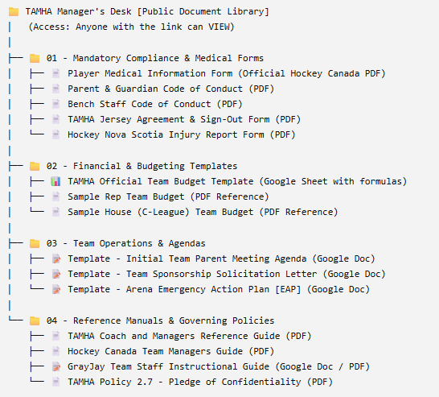

# TAMHA Google Workspace Consolidation & Document Architecture Plan

This blueprint outlines the consolidation of all **Truro Area Minor Hockey Association (TAMHA)** manager documentation, forms, budgets, and compliance assets into a single, permanent Google Workspace repository, replacing brittle individual GrayJay CMS file uploads.

---

## 1. Executive Summary: Why This Solves a Multi-Year Problem

In previous seasons, TAMHA documents (PDFs, budget sheets, forms) were individually uploaded directly into the GrayJay CMS media library. 

### The Pitfalls of GrayJay File Uploads:
1. **Broken Links Every Season:** GrayJay uploads generate static URL hashes containing specific timestamps and years (e.g., `/source/0/Managers%20Desk/Code%20of%20Conduct%202022.pdf`). Whenever a form is revised for a new season, uploading a new file creates a new URL, breaking every hyperlink on the website unless manually located and edited across multiple pages.
2. **Static & Unusable Formats:** Parents and managers cannot interact with static PDFs without third-party converters. Budgets must be manually retyped because PDF formulas cannot calculate.
3. **Admin Bottleneck:** Every minor tweak requires website admin intervention to re-upload files and edit page HTML.

### The Google Workspace Solution:
1. **One Permanent URL:** The website and manager communications point to a single, permanent Google Drive Shared Folder (e.g., `trurominorhockey.ca/managers/drive` or direct Drive link).
2. **In-Place Annual Rollover:** In August of each new season, TAMHA executive members simply upload new versions into the Google Drive folder using Google Drive's native **"Manage versions" / Replace** function. **Not a single URL or webpage link breaks.**
3. **Interactive "Make a Copy" Templates:** Budgets and agendas in Google Sheets and Google Docs allow managers to click **"Make a copy"** directly into their own Google Drive, preserving all automated formulas and formatting.
4. **Instant Synchronization:** Updates to policies, tournament links, or checklists take effect immediately everywhere.

---

## 2. Recommended TAMHA Google Drive Folder Architecture

Set up a Dedicated Shared Folder within the official TAMHA Google Workspace:



```text
📁 TAMHA Manager's Desk [Public Document Library]
│   (Access: Anyone with the link can VIEW)
│
├── 📁 01 - Mandatory Compliance & Medical Forms
│   ├── 📝 SOP - HCR 3.0 Profile Setup & Mandatory Waiver Sign-Off (Google Doc)
│   ├── 📄 Player Medical Information Form (Official Hockey Canada PDF)
│   ├── 📄 Parent & Guardian Code of Conduct (PDF)
│   ├── 📄 Bench Staff Code of Conduct (PDF)
│   ├── 📄 TAMHA Jersey Agreement & Sign-Out Form (PDF)
│   └── 📄 Hockey Nova Scotia Injury Report Form (PDF)
│
├── 📁 02 - Financial & Budgeting Templates
│   ├── 📊 TAMHA Official Team Budget Template (Google Sheet with formulas)
│   ├── 📄 Sample Rep Team Budget (PDF Reference)
│   └── 📄 Sample House (C-League) Team Budget (PDF Reference)
│
├── 📁 03 - Team Operations & Agendas
│   ├── 📝 Template - Initial Team Parent Meeting Agenda (Google Doc)
│   ├── 📝 Template - Team Sponsorship Solicitation Letter (Google Doc)
│   └── 📝 Template - Arena Emergency Action Plan [EAP] (Google Doc)
│
└── 📁 04 - Reference Manuals & Governing Policies
    ├── 📄 TAMHA Coach and Managers Reference Guide (PDF)
    ├── 📄 Hockey Canada Team Managers Guide (PDF)
    ├── 📝 GrayJay Team Staff Instructional Guide (Google Doc / PDF)
    └── 📄 TAMHA Policy 2.7 - Pledge of Confidentiality (PDF)
```

---

## 3. Permissions, Access Control & Document Locking

To maintain security, integrity, and privacy:

| User Role | Google Drive Access Level | GrayJay CMS Access Level | Permissions Scope |
|---|---|---|---|
| **TAMHA Executive / Tech Director (Josh, VP Finance)** | **Manager / Owner** | **Super Admin** | Full control over Google Drive root and website. |
| **Site Documentation Admin (Matt Redmond)** | **Content Manager** | **Site / Page Admin** | Can upload, replace, and organize folder contents and edit Manager Desk pages. |
| **Team Managers & Coaches** | **Viewer** | **Team Staff / Manager** | Can view all docs, download PDFs, and click "Make a copy" on Google Docs/Sheets templates. |
| **Parents & Public** | **Viewer** (via public link) | **Public Visitor** | Read-only access to view and download blank compliance forms. |

### Document Locking Strategies: Can We Lock Certain Documents Completely?

Yes! Google Workspace provides several levels of document locking depending on the type of document:

1. **Full Read-Only / Anti-Copy Lock (For Official Policies & Bylaws):**
   * For documents that should be strictly read-only and never altered or scraped (e.g., *Policy 2.7 Confidentiality*, *Code of Conduct*, *Bylaws*):
   * In Google Drive, open the file share settings &rarr; click ⚙️ **Settings gear** &rarr; uncheck **"Viewers and commenters can see the option to download, print, and copy"**.
   * *Result:* The document opens in browser-only view. The options to download, print, select text, or "Make a copy" are completely disabled.
2. **Native File Locking (Prevent Accidental Admin Edits):**
   * Right-click the file in Google Drive &rarr; **File information &rarr; Lock**.
   * *Result:* Even users with edit permissions cannot alter the document until an authorized admin explicitly unlocks it. This prevents accidental overwrites or stray keystrokes on master templates.
3. **Protected Ranges & Formula Locks (For Google Sheets Templates):**
   * In the master *Team Budget Template*, use **Data &gt; Protect sheets and ranges** to lock all calculation cells, formulas, and category headers.
   * When managers click `/copy`, their copied sheet inherits the formula protections, preventing broken math or accidental cell deletions.
4. **Enforcing "Make a Copy" Links for Templates:**
   * For editable templates (Budget, Parent Meeting Agenda, Sponsorship Letter), the website links use Google's native `/copy` parameter instead of `/edit`:
   * `https://docs.google.com/spreadsheets/d/[FILE_ID]/copy`
   * *Result:* When clicked, Google immediately prompts: *"Would you like to make a copy of TAMHA Official Team Budget Template?"* Users cannot touch or edit the master file.

---

## 4. Staying Compliant with TAMHA Policy 2.7 (Pledge of Confidentiality)

As an authorized GrayJay site administrator and documentation custodian who has signed the **TAMHA Policy 2.7 Pledge of Confidentiality**, the following protocols must be maintained:

1. **Zero Personal Identifiable Information (PII) in Master Templates:**
   * Master spreadsheets in Google Drive must contain ONLY generic placeholders (e.g., `Player 1`, `Player 2`, blank jersey deposit check numbers).
   * Sample budgets must use rounded mock figures, never actual player names or specific parent payment histories.
2. **Clear Separation of Public Templates vs. Team Private Data:**
   * The **Public Document Library** holds strictly **blank templates and public policies**.
   * Filled-in Player Medical Forms, parent phone numbers, and child health notes must **NEVER** be stored in the public shared folder. They remain in private team drives or physical bench binders accessible strictly to the head coach, manager, and certified safety rep.
3. **Secure Handling of Admin Credentials:**
   * GrayJay admin credentials must not be shared.
   * Access to administrative pages must use secure passwords with session timeout.
4. **Secure Disposal & Archiving:**
   * Temporary exports or drafts containing real team data must be sanitized or destroyed in accordance with Policy 2.7.

---

## 5. Annual Rollover Standard Operating Procedure (SOP)

When the 2027–2028 season approaches (and every season thereafter), the rollover process takes under 5 minutes:

1. Open the **TAMHA Manager's Desk [Public Document Library]** in Google Drive.
2. Right-click any document that has updated (e.g., `Parent Code of Conduct`).
3. Select **File Information > Manage versions > Upload new version**.
4. Upload the revised PDF or update the Google Sheet dates.
5. **Done.** All existing links on `trurominorhockey.ca` and in manager bookmarks immediately serve the latest version. No broken links. No HTML edits.

---

## 6. Draft Message for Josh (Tech Director)

You can send or adapt this quick note to Josh to present the system:

> **Subject:** TAMHA Documentation & Google Workspace Consolidation
> 
> Hi Josh,
> 
> Thanks again for getting me set up with admin access! I signed and sent over the Confidentiality Policy earlier today.
> 
> While prepping the Manager's Desk pages, I built out an architecture that leverages our new TAMHA Google Workspace to solve the annual "broken link" headache we've had with GrayJay uploads in past years.
> 
> Instead of uploading static PDFs into GrayJay that break every time dates or policies update, we've organized all the master templates, compliance forms, and budget sheets into a single, structured **TAMHA Manager Document Library** in Google Drive:
> 
> 1. **Permanent Links:** The GrayJay pages link to the Google Drive folder and docs. When documents change annually, we just upload a new version in Google Drive—not a single website link breaks.
> 2. **Interactive Templates:** Managers can click a single button to "Make a copy" of the official budget spreadsheet or parent meeting agenda directly into their own Google Drive with all formulas ready to go.
> 3. **Clean Permissions:** The folder is set to public "View Only," so master documents can never be accidentally edited by parents or team staff.
> 
> The pages and exports are built and ready to go. Let me know what you think, and I can drop the folder into our TAMHA Workspace whenever you're ready!
> 
> Best,  
> Matt
