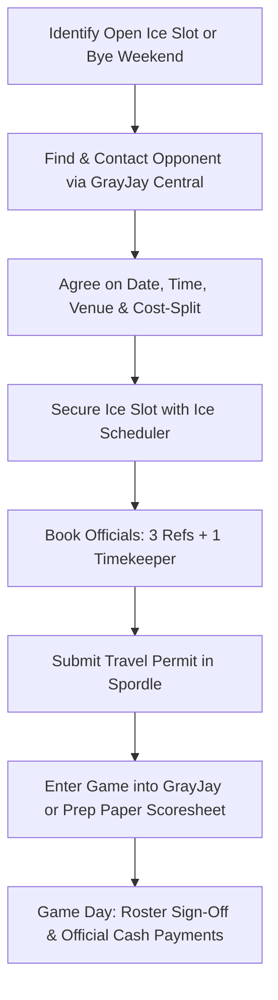

# U11A Coach & Manager Handoff Guide: Exhibition Games, Tournaments & Season Operations

This playbook provides actionable guidance, proven templates, and real-world procedural knowledge collected from the U11A Bearcats archives to ensure a seamless transition for the incoming Head Coach and Team Manager.

---

## 1. Booking Exhibition Games: Step-by-Step Rules & Protocols

Exhibition games provide vital development and game repetitions outside of regular league play, but they operate under strict Hockey Nova Scotia (HNS) and Truro Area Minor Hockey Association (TAMHA) governance.

### Core Rules & Compliance Requirements
1. **Seasonal Game Cap (Maximum 45 Games)**:
   * Under Hockey Nova Scotia (HNS) Regulations and the Hockey Canada U11 Player Pathway, **the maximum number of games a U11 team may play in a season is 45 games**.
   * **What counts toward the 45-game cap**: All exhibition games, regular season league games, and tournament games.
   * **Tournament Counting Formula**: For the purpose of the 45-game cap, **every tournament counts as exactly three (3) games**, regardless of how many games the team actually plays (even if you play 5 or 6 games by reaching the finals).
   * **Exemptions**: League playoffs, Conference championships, Day of Champions, and Provincial tournaments **do NOT count** against the 45-game cap.
   * **Practical Math for Schedulers**: A standard NCHL league schedule is ~20–24 games. If your team enters 3–4 tournaments (3 games each = 9–12 games counted), you have room for approximately **9 to 14 exhibition games** total before reaching the 45-game ceiling.
   * **Practice Ratio**: HNS requires striving for a 2:1 practice-to-game ratio. The total number of games played must never exceed the total number of team practices.
2. **Out-of-Province Travel Limit (Maximum 2 Trips)**:
   * **U11 teams are permitted to travel outside Nova Scotia a MAXIMUM of two (2) times per season** under HNS regulations.
   * This strictly caps how many out-of-province events you can book (e.g., maximum 2 trips across PEI or New Brunswick combined for tournaments and/or exhibition games).
   * (U7 and U9 teams are not permitted to travel out of province at all).
3. **Mandatory Spordle Travel Permits**:
   * **Every exhibition game requires an approved Travel Permit**, regardless of whether you are the home team or the visiting team, and whether you are playing in-league or out-of-league.
   * Permits must be requested through [Spordle Permits](https://myaccount.spordle.com/manage/permit) at least **7–10 days in advance**.
   * *Playing an unsanctioned game forfeits Hockey Canada insurance coverage for players, bench staff, and facilities.*
4. **League Priority**:
   * Scheduled regular-season games always take precedence over exhibition matches.
   * You cannot cancel or reschedule an official league game to play an exhibition without written sign-off from both associations and the North Conference Hockey League (NCHL) Scheduler.
5. **Affiliate Player (AP) Regulations**:
   * Affiliates can play in exhibition games with prior mutual agreement between both Head Coaches.
   * **Crucial Rule**: Every exhibition game counts toward the player's strict **10-game AP maximum** for the season. Keep a dedicated tracking column for AP appearances.

---

### Step-by-Step Exhibition Booking Workflow

#### Step 1: Identifying & Sourcing Opponents
* Use [GrayJay Central](https://grayjaycentral.ca/) to find contact information for coaches and managers across Nova Scotia and New Brunswick.
* Navigate to your division (U11A), select regional associations (e.g., South Colchester / Brookfield Elks, Pictou County Crushers, Antigonish Bulldogs, Westville, Sackville, Northside Vikings), and view the **Staff** tab for manager/coach emails and phone numbers.
* *Archive Pro-Tip*: Neighboring teams visiting your region for an away series (e.g., Cape Breton / Northside teams visiting Pictou) frequently look for an extra Saturday evening or Sunday morning game to make their travel worthwhile.

#### Step 2: Ice Procurement & Cost Reimbursement
* **TAMHA Home Ice**:
  * Email TAMHA Ice Scheduler Craig Cameron (`ice@trurominorhockey.ca`) to request available ice slots (e.g., Colchester Legion Stadium or Debert Arena).
  * If your assigned weekend league ice is vacant due to an away tournament or bye, immediately contact Craig to repurpose it for your exhibition game.
* **Neutral / External Ice Booking**:
  * If local ice is unavailable, you can book ice in surrounding facilities (e.g., Hector Arena in Pictou, Brookfield Sportsplex, or Deuvilles Rink).
  * **TAMHA Reimbursement Precedent**: When Truro hosted an exhibition game at Hector Arena ($285) because no local home ice was available, TAMHA President Andy Bonnell approved reimbursing the ice fee back to the team account from Truro's regular season ice allocation. Keep all official invoice receipts and e-transfer confirmations to submit for reimbursement.

#### Step 3: Arranging Referees & Timekeepers
* **Home Ice Games**:
  * Contact the TAMHA Referee-in-Chief (RIC) and league officials assignor well in advance.
  * *Required Officiating Crew for U11A*: **3 On-Ice Referees** and **1 Off-Ice Timekeeper/Scorekeeper**.
  * *Budget Rates*:
    * 3 Referees: ~$30.00 each = **$90.00**
    * 1 Timekeeper: **$30.00**
    * Total Officiating Cash Needed: **~$120.00** per home exhibition game.
  * **Payment Protocol**: Referees and timekeepers are paid in **cash** in the referee room prior to puck drop or immediately after the game. Ensure the team manager brings exact cash.
* **Outside / Neutral Rinks**:
  * If playing at an arena like Hector Arena or Brookfield, coordinate with the host arena manager or local association RIC to assign local certified officials.
* **Cancellations**:
  * If an exhibition game is cancelled (weather, ice issues), notify the RIC and `info@trurominorhockey.ca` immediately. Failure to provide adequate notice will result in the team being billed show-up fees.

#### Step 4: Game Sheet Protocols
* **In-League Opponent**: The home manager enters the exhibition game into [GrayJay](https://trurominorhockey.ca). Both teams verify and digitally sign off the roster on the GrayJay Teams app.
* **Out-of-League Opponent**: If the opponent is from outside the league or province and cannot access your GrayJay system, you **must use an official paper game sheet**.
  * Keep blank 3-part carbon game sheets and roster label stickers in your manager binder.
  * Have both coaches sign the paper sheet, record all goals/penalties, and photograph the sheet immediately following the game.

---

## 2. Tournament Planning, Deadlines & Logistics

Tournaments are the highlight of the minor hockey season, but require rapid coordination early in September and October.

### Key Deadlines & Procedural Rules
1. **Apply Early (August – October)**:
   * Competitive division spots fill within weeks of opening. Do not wait for regular season league games to start before submitting tournament applications.
2. **Notify NCHL Scheduler Immediately**:
   * North Conference Hockey League (NCHL) Scheduler Matt Oxford (`northconferencehockeyleague@gmail.com`) builds league schedules without a central scheduling meeting.
   * **Mandatory Action**: Email Matt your confirmed tournament dates by **early October**. He will blackout your team for those weekends. If you register for a tournament late without notifying the league, you will be forced to coordinate and pay for rescheduling league games.
3. **Spordle Sanctioned Travel Permits**:
   * Apply through [Spordle](https://myaccount.spordle.com/manage/permit) at least **14 days prior** to tournament start.
   * You will need:
     * Sanction Permit Number (provided by tournament organizers).
     * Exact Arena Venues & City.
     * Approved Hockey Canada Registry (HCR) Team Roster PDF.
4. **Hotel Room Blocks**:
   * Reserve **18 to 20 rooms** (Double Queen or King with Pull-Out Couch) under a team block code immediately upon applying.
   * Provide parents with the cutoff release date (usually 30 days prior to check-in).

---

### Recommended Tournaments for U11A

| Tournament | Location | Typical Timing | Historical Cost | Notes & Key Takeaways |
| :--- | :--- | :--- | :--- | :--- |
| **Bluenose Tournament** | Sackville / HRM, NS | Late October | ~$900 – $1,000 | Excellent early-season team bonding and chemistry test before regular season grind. |
| **Amherst Minor Hockey Tournament** | Amherst, NS | Nov / Dec | ~$867.00 | Accessible drive from Truro; balanced competition; hotel or day-trip optional. |
| **Norseman Memorial Tournament** | Montague, PEI | Early January | ~$850.00 | Premier travel tournament. Outstanding atmosphere and hospitality. Book hotel blocks in Montague/Charlottetown in September. |
| **Pioneer Tournament** | Oromocto / Fredericton, NB | Mid-January | ~$900 – $1,100 | Large interprovincial draw; great competition against New Brunswick teams. |
| **Joe Lamontagne Memorial Tournament** | Cole Harbour / Dartmouth, NS | Mid-March | ~$1,100 – $1,300 | One of the largest minor tournaments in Atlantic Canada. Very fast-paced and well organized. |
| **NCHL West Division Playoff Tournament** | Antigonish, NS | Mid-March | ~$1,032.29 | Mandatory league championship tournament (7 teams, 3-4 round-robin games, semi-finals & final banner game). |
| **SEDMHA Honda Minor Tournament** | Halifax Regional Municipality | Late March | ~$1,032 – $1,325 | Historic 4-day tournament. Games spread across HRM (Greenfoot Energy Centre, RBC Centre, BMO, Cole Harbour, St. Margaret's). First game typically Thursday afternoon. |

---

### Tournament Roster & Affiliate Management
* **Official HCR Roster**: Keep 10+ printed copies of your official HCR roster in the team binder. Most tournament headquarters require a paper copy at registration desk check-in.
* **Affiliate Players at Tournaments**:
  * If an affiliated goalie or skater is replacing an absent player, confirm approval with the player's primary coach.
  * Note: HCR rosters lock in mid-season and cannot be modified. Have the TAMHA Web Director (`tamhaweb@trurominorhockey.ca`) add the AP to your GrayJay roster, and carry email confirmation from TAMHA VP Hockey Ops/President if organizers ask for proof.

---

## 3. High-Value Financial & Operational Insights

From the 2025–2026 U11A financial statements and operations records:

### 1. Financial Obligations & Deadlines
* **TAMHA Rep Fees**: **$7,700 per team** (~$452.95/player for 17 players). Payable to TAMHA in two equal 50% installments:
  * Installment 1: **November 15th** ($3,850)
  * Installment 2: **January 31st** ($3,850)
* **TAMHA Sweater Fund**: **$550 per team**, due **November 15th**.
* **Jersey Security Deposits**:
  * Collect **$150 per player** upon jersey handover.
  * Strongly recommend post-dated cheques dated **May 15th** payable to *TAMHA*.
  * Cheques remain uncashed in the manager file and are returned/shredded in spring when washed jerseys (with namebars/sponsor patches neatly removed) are returned.
* **Team Bank Account**:
  * Held at **Mosaik Credit Union**.
  * Two signing officers required (e.g., Manager + Treasurer or Head Coach).
  * Email `vpfinance@trurominorhockey.ca` with names, roles, phone numbers, and emails to receive the bank authorization letter.
* **Mandatory Budget Filing Dates**:
  * *Preliminary Budget*: October 30 / November 15 (Board & Parents)
  * *Mid-Season Statement*: December 31 (Parents)
  * *Interim Budget*: January 15 (VP Finance)
  * *Final Budget & Statements*: March 31 / April 15 (Board & Parents)
  * *Account Closure*: April 30

### 2. High-Yield Sponsorship Strategy
* The U11A team raised **$6,200** in sponsorship contributions, drastically reducing parent out-of-pocket costs:
  * **Title Sponsor**: $1,000 – $1,500
  * **Gold Sponsor**: $500 (Large banner logo)
  * **Silver Sponsor**: $250 (Medium banner logo)
  * **Bronze Sponsor**: $100 (Name on banner)
* **Team Sponsor Banner**:
  * Produced via local printers (e.g., ASE Print on Pictou Rd).
  * Use a retractable roll-up banner stand placed at arena entrances and behind the bench during games.
  * *Adult Goods Policy*: If adult-market businesses (alcohol, cannabis) sponsor the team, HNS rules prohibit placing their branding on team banners or jerseys; acknowledge them via a private team thank-you letter.

### 3. Dressing Room Safety & "Rule of Two"
* Strictly follow the **Rule of Two** (Hockey Canada / HNS):
  * A minimum of **two screened, certified adults** (coaches or registered locker room monitors) must be present in the dressing room before any player is permitted to enter.
  * Players must wait outside the room with gear until two monitors arrive.
  * Players must arrive wearing a base layer (shorts/t-shirt or compression suit).
* **Coaching Clinic Reimbursements**:
  * Team volunteers who complete required clinics (e.g., Hockey Canada Safety Program ~$62.68) can submit receipts to TAMHA (`trurominorhockey@gmail.com`) for association reimbursement.

---

## 4. Key Contact Directory

| Role / Function | Contact Name / Office | Email | Notes |
| :--- | :--- | :--- | :--- |
| **TAMHA President** | Andy Bonnell | `president@trurominorhockey.ca` | Financial approvals, neutral ice reimbursement |
| **VP Competitive Hockey Ops** | Derek Bjorklund | `vpcom@trurominorhockey.ca` | Competitive guidelines, exhibition protocol |
| **TAMHA Ice Scheduler** | Craig Cameron | `ice@trurominorhockey.ca` | League ice assignments, makeup slots |
| **TAMHA VP Finance** | VP Finance Desk | `vpfinance@trurominorhockey.ca` | Bank signers letter, budget submissions |
| **TAMHA Web & Tech Director** | Josh Burcham | `tamhaweb@trurominorhockey.ca` | GrayJay setup, roster edits, AP additions |
| **NCHL League Scheduler** | Matt Oxford | `northconferencehockeyleague@gmail.com` | League schedule, tournament blackout dates |
| **Referee-in-Chief (RIC)** | TAMHA Officiating Desk | Via `info@trurominorhockey.ca` | Booking refs & timekeepers, cancellations |
